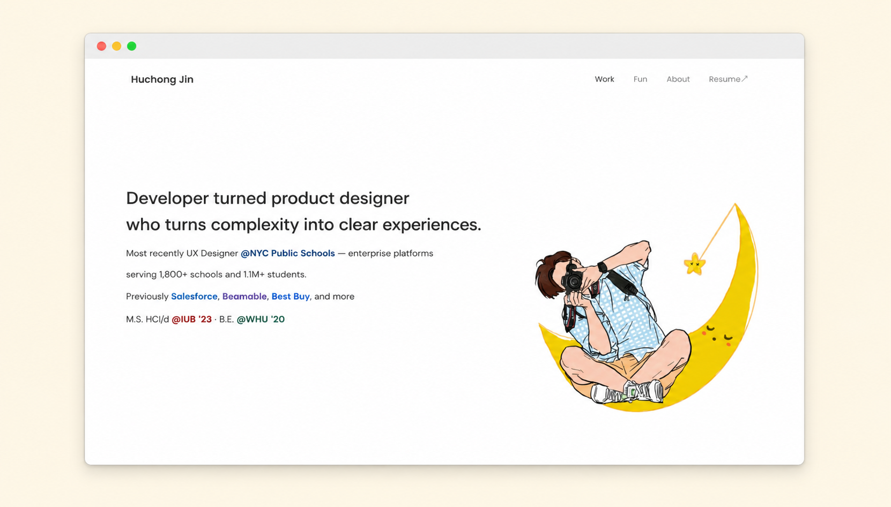

# huchongjin.com — Portfolio Site (V1)



Source for [huchongjin.com](https://huchongjin.com), a UX designer's portfolio.

This is a **V1 snapshot** captured 2026-05-03. The site has been live since 2025 and is iterating; future major versions will land here as new commits.

## Stack

Static HTML + CSS + vanilla JS. No build step. Deployed via Vercel.

Originally **built with [Webflow](https://webflow.com)** — chosen over more-constrained no-code platforms (Squarespace, Wix) for its custom-CSS support, code embeds, and clean static export. Exported to plain HTML in 2025 and hand-edited since. Two stylesheets in play:

- `css/webflow.css` — Webflow's base reset + utility classes (mostly untouched since export)
- `css/styles.css` — Hand-written overrides + design system tokens + case-study-specific styles

## Structure

```
.
├── index.html          # Homepage (work showcase)
├── about.html          # About page
├── fun.html            # Side projects + experiments
├── work/               # Case study pages
│   ├── oasis-confidential.html   # NYC DOE OASIS Confidential Services (V3)
│   ├── salesforce.html           # Salesforce externship
│   ├── beamable.html             # Beamable game-services platform
│   ├── finditnow.html            # FindItNow
│   └── mindtracker.html          # School project — Fitbit anxiety mgmt
├── css/
├── js/
└── images/             # All assets (Webflow naming convention preserved)
```

## How this was built

The original Webflow build (2024) and early hand-editing (2025) were solo work. **Pair-building with [Claude Code](https://claude.com/claude-code) began in 2026** — recent commits use the `Co-Authored-By: Claude` attribution to mark AI-paired sessions. The OASIS Confidential case study V8 rewrite (Q1 2026 — storytelling rebuild + image annotations) was the first fully AI-paired session and is a good reference for how I work with Claude.

### What's mine, what's AI

- **Design decisions + design system** (layout, hierarchy, narrative structure, color palette, typography, what to show vs cut, content tone) — me. Claude doesn't get to opinion-shop on design.
- **Implementation** (HTML markup, CSS rules, the `validate-images.py` audit script, content rewrites, micro-copy refinement) — AI-paired. I direct, Claude drafts, I review every line before commit.
- **Audit + iteration** — AI-augmented. A portfolio-audit skill scores this site against an 8-category rubric (10-Sec Gut Check / Work is Hero / Ruthless Curation / Storytelling / Ambition & Scope / Soul / Portfolio as Product / Builder Signals), surfaces gaps, and seeds the next round of work. The next iteration here (V2) is shaped by that rubric.

### Workflow infrastructure

This repo is one node in a broader AI-assisted job search system. Adjacent components (some live in private workspaces, public versions are being extracted progressively):

- **Domain skills** — `/job` (application flow), `/job-pitch` (cover letters + question answers), `/interview` (prep + debrief), `/start-my-day` (daily morning briefing aggregating email + applications + networking)
- **Content tooling** — `/case-study-builder` (generates HTML case study pages from approved markdown content; used to ship the OASIS Confidential page)
- **Workflow tooling** — event-debrief skill (planned public release at [`jarvis1108/event-debrief-skill`](https://github.com/jarvis1108/event-debrief-skill) — package coming soon)

The skill source itself isn't in this repo. The **artifacts** these skills produce — case study pages, optimized images, audit reports, validate-images.py — show up here as commits.

## Build Notes

### V1 (this snapshot)

- Captured at commit `1cde3fe` of the source monorepo (2026-04-08)
- OASIS Confidential case study at V3 (storytelling rewrite + image annotations — the first AI-paired build)
- Other case studies are Webflow-export legacy (Salesforce, Beamable, FindItNow, MindTracker)
- About + Fun pages use original Webflow layout

### Planned (future versions)

- Homepage redesign with AI-prominent narrative + interactive demo
- Three new case study pages (OASIS Transportation, ATLAS IHMS, ATLAS Design System)
- Likely architecture migration to Tailwind CSS (and possibly React + shadcn/ui)
- Visual treatment refresh on Salesforce / Beamable to align with OASIS quality bar
- New analytics stack (replacing the legacy GA + Hotjar that were stripped from this V1 mirror) capturing page time + nav paths + scroll depth as input to the audit rubric

## Running locally

No build step. Open `index.html` in a browser, or run any static file server:

```bash
python3 -m http.server 8000
# or
npx serve .
```

## License

[MIT](LICENSE) — code only. Project case studies, screenshots, photographs, and copy are © Huchong Jin and not licensed for reuse.

## Contact

Huchong Jin — Product Designer
[huchongjin.com](https://huchongjin.com) · [LinkedIn](https://www.linkedin.com/in/huchongjin/) · jhuchong@gmail.com
